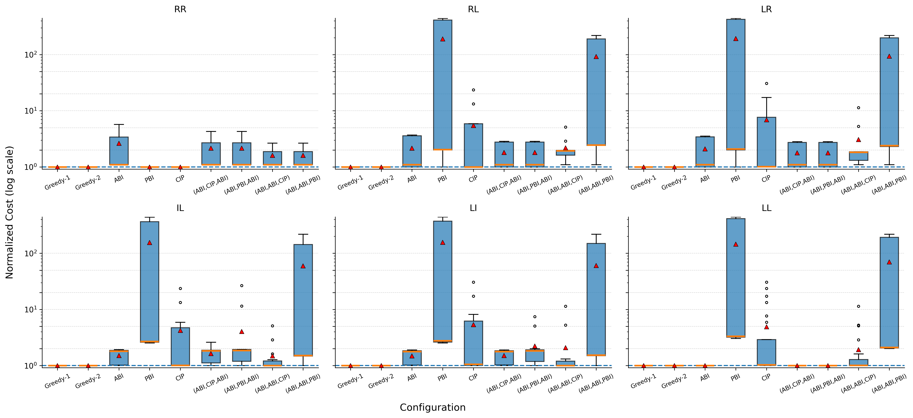

# Synthetic Hierarchy-Position Workloads

This directory contains the synthetic experiment used to study how the
hierarchy levels accessed by a workload affect the preferred inheritance
mapping.

Unlike the preceding experiments, this experiment compares **estimated
component costs** rather than PostgreSQL execution times. It evaluates six
workload structures and nine mapping configurations. Within each workload,
every component cost is normalized by the lowest estimated cost observed for
that component across the nine configurations.

## Synthetic schema

The paper schema contains two binary inheritance hierarchies, `R` and `S`.
Each hierarchy has three levels:

```text
Level 0:              R                         S
                     / \                       / \
Level 1:          R1     R2                 S1     S2
                  / \    / \                 / \    / \
Level 2:        R3 R4  R5 R6              S3 S4  S5 S6 S7
```

Each hierarchy therefore contains seven entity sets. The paper creates an M:N
relationship between every entity pair across the two hierarchies, producing:

```text
7 x 7 = 49 M:N relationship sets
```

In `example2_synthetic.json`, these relationships use the `RM_` prefix. For
example, `RM_R3_S5` connects leaf entity sets `R3` and `S5`.

Experiment 4 in the paper uses the 49 M:N relationships. The six workload
files must therefore assign nonzero weights only to the applicable entities
and `RM_` relationships. 

## Relevant files

| File | Purpose |
|---|---|
| `example2_synthetic.json` | Base schema and component statistics. |
| `scripts-1.py` | Generates the four mixed level-specific inheritance configurations. |
| `test_file-1.py` | Invokes schema selection and component-cost estimation. |
| `ER-experiments - Sheet19.csv` | Component-level estimated costs for six workloads and nine configurations. |
| `boxplot-costs-1.py` | Normalizes the component costs and generates the six-panel boxplot. |
| `boxplots_all_workloads_1.png` | Figure generated from the supplied raw CSV. |


## Workload definitions


| Workload | Left hierarchy | Right hierarchy | Entities | M:N relationships | Total components |
|---|---|---|---:|---:|---:|
| RR | Root `R` | Root `S` | 2 | 1 | 3 |
| RL | Root `R` | Leaves `S3`--`S6` | 5 | 4 | 9 |
| LR | Leaves `R3`--`R6` | Root `S` | 5 | 4 | 9 |
| IL | Internal `R1`,`R2` | Leaves `S3`--`S6` | 6 | 8 | 14 |
| LI | Leaves `R3`--`R6` | Internal `S1`,`S2` | 6 | 8 | 14 |
| LL | Leaves `R3`--`R6` | Leaves `S3`--`S6` | 8 | 16 | 24 |

For example, RL contains:

```text
R, S3, S4, S5, S6,
RM_R_S3, RM_R_S4, RM_R_S5, RM_R_S6
```

## 1. Enable statistics-only cost evaluation

This experiment does not require materializing and executing the generated
data. Configure the experiment path to generate statistics rather than tuples:

- In `workload_generator.py`, use the statistics-only
  `generate_test_stat_data` path instead of full test-data materialization.
- In `test_file-1.py`, use
  `load_workload_queries_node_costs_only(db_name, load_file)` in `init_database` to collect
  component-level estimated costs.
- Disable the normal `load_workload_queries` execution path for this
  experiment.

Every one of the 54 experiment runs must use the same `node_data` and cost
model parameters.

## 2. Configure the nine mappings

The experiment evaluates:

| Result column | Mapping/search configuration |
|---|---|
| `Greedy-1` | Greedy search with random starts using objective 1. |
| `Greedy-2` | Greedy search with random starts using objective 2. |
| `ABI` | ABI for every hierarchy node. |
| `PBI` | ABI roots and PBI for every subclass. |
| `CIP` | ABI roots and CIP for every subclass. |
| `(ABI,CIP,ABI)` | ABI roots, CIP internal nodes, ABI leaves. |
| `(ABI,PBI,ABI)` | ABI roots, PBI internal nodes, ABI leaves. |
| `(ABI,ABI,CIP)` | ABI roots and internal nodes, CIP leaves. |
| `(ABI,ABI,PBI)` | ABI roots and internal nodes, PBI leaves. |

### Greedy-1

In `start_search_for_schema_for_generated_workload` in `helper_functions.py`,
invoke:

```python
greedy_search_with_random_starts(...)
```

### Greedy-2

Invoke:

```python
greedy_search_with_random_starts_for_obj_of_optimizing_for_normalized_costs(...)
```

### Uniform ABI, PBI, and CIP mappings

For these fixed configurations, invoke `greedy_search` and set its iteration
count to `0` so that the search does not change the initial mapping.

Use the following common options in `search_algorithm_all_attributes.py`:

```python
default_options = {
    "entity": ["all_by_itself"],
    "weak_entity": ["all_by_itself"],
    "sub_class": [SUBCLASS_MAPPING],
    "1_N_relationship": ["all_by_itself"],
    "M_N_relationship": ["all_by_itself"],
    "multi_valued_attribute": ["contained_in_parent"],
}
```

Set `SUBCLASS_MAPPING` as follows:

| Configuration | `SUBCLASS_MAPPING` |
|---|---|
| ABI | `"all_by_itself"` |
| PBI | `"partially_by_itself"` |
| CIP | `"contained_in_parent"` |

### Mixed level-specific mappings

`scripts-1.py` defines the four mixed mappings:

| Script variable | Generated configuration |
|---|---|
| `level_mapping_1` | `(ABI,CIP,ABI)` |
| `level_mapping_2` | `(ABI,PBI,ABI)` |
| `level_mapping_3` | `(ABI,ABI,CIP)` |
| `level_mapping_4` | `(ABI,ABI,PBI)` |


```python
print_config(level_mapping_4)
```

To generate each configuration, change that final argument and run the script
once per mapping. For example:

```bash
mkdir -p generated_configs
python3 scripts-1.py > generated_configs/abi_abi_pbi.txt
```

For a more robust schema path, change the script's load-file definition to:

The script prints assignments of the form:

```python
config["r"] = "all_by_itself"
config["r1"] = "contained_in_parent"
config["r3"] = "all_by_itself"
```

Apply the generated assignments to the fixed starting configuration, invoke
`greedy_search`, and set the iteration count to `0`.

## 3. Run the experiment

Evaluate every workload under every mapping:

```text
6 workloads x 9 configurations = 54 runs
```
A representative command is:

```bash
python3 test_file-1.py \
    init \
    synthetic_rr_greedy1 \
    workloads/example2_synthetic_rr.json
```

For each run, preserve the component-level estimated costs. The outputs are written to `output.csv`.

## 4. Construct the raw cost CSV

Combine the 54 runs into a single CSV:

```text
ER-experiments - Sheet19.csv
```

Use this exact column order:

```text
Greedy-1,Greedy-2,ABI,PBI,CIP,(ABI,CIP,ABI),(ABI,PBI,ABI),(ABI,ABI,CIP),(ABI,ABI,PBI)
```

Create six contiguous blocks in this order:

```text
RR, RL, LR, IL, LI, LL
```

Repeat the header at the beginning of every block. A blank separator row may
appear between blocks. The component rows must be aligned across all nine
columns: each row must contain the nine estimated costs for the same
conceptual component.

The supplied raw CSV has the following verified structure:

| Workload block | Numeric component rows |
|---|---:|
| RR | 3 |
| RL | 9 |
| LR | 9 |
| IL | 14 |
| LI | 14 |
| LL | 24 |
| **Total** | **73** |

Thus, the result contains:

```text
73 components x 9 configurations = 657 estimated-cost values
```

`boxplot-costs-1.py` assigns workload names based only on block order and
assigns row identifiers based only on row position. Missing, additional, or
reordered rows will therefore invalidate the normalization.

## 5. Generate Figure 10

Place `boxplot-costs-1.py` and `ER-experiments - Sheet19.csv` in the same
directory, then run:

```bash
python3 boxplot-costs-1.py
```

The script produces:

```text
boxplots_all_workloads_1.png
```

Expected result:



For every workload component `c` and configuration `s`, the script computes:

```text
normalized_cost(c,s) = cost(c,s) / min_s' cost(c,s')
```

Consequently, the lowest cost for every component is normalized to `1`. Each
subplot contains one box plot per configuration:

- the orange line is the median;
- the red triangle is the arithmetic mean;
- the box spans the interquartile range;
- the whiskers and circles show the remaining range and outliers; and
- the dashed horizontal line at `1` denotes the component-wise optimum.

All six subplots share a logarithmic y-axis.

